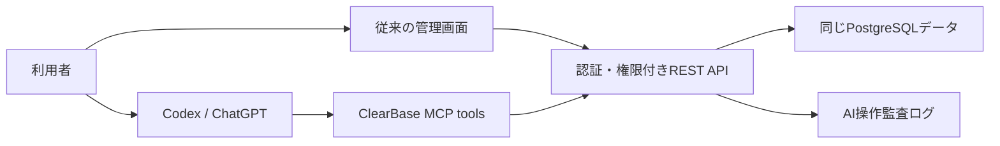

# ClearBase AI直接操作 設計・利用ガイド

## 基本方針

管理画面とAIは、別々のデータを持ちません。どちらも同じ認証済みREST APIを通して、同じPostgreSQLデータを更新します。したがって、AIで追加した予定・タスク・ミッション・プロジェクト・メモは、従来の管理画面へそのまま反映されます。



AIへユーザーIDやパスワードを渡してはいけません。利用者は管理画面上で現在のパスワードを入力して本人確認し、用途・権限・有効期限を限定したAI接続トークンを発行します。トークンは一度だけ表示され、DBにはSHA-256ハッシュだけを保存します。

## 現在の安全境界

- 一般公開のユーザー登録は本番環境で無効です。公開登録を明示的に許可した開発環境でも、作成される役割は `MEMBER` 固定です。
- 従来のログイン候補一覧と、MASTER / SUPPORTによるユーザー作成は維持します。SUPPORTからMASTERへの権限昇格だけは禁止します。
- ログイン、ログイン候補一覧、公開登録、AI接続発行にはレート制限を設け、総当たりと大量発行を抑止します。
- 自分自身のユーザー更新から、役割変更やパスワード変更はできません。
- MASTERが他人の平文パスワードを閲覧する機能は廃止しました。
- 本番環境では `JWT_SECRET` が必須です。既存運用との互換性のため、未設定時のGoogleトークン暗号鍵は従来どおりJWT鍵から導出しますが、新規環境では別値の `GOOGLE_TOKEN_ENCRYPTION_KEY` を推奨します。既存の暗号鍵を変更する際は、移行期間だけ旧値を `GOOGLE_TOKEN_ENCRYPTION_KEY_PREVIOUS` に設定できます。
- AI接続は期限付き・個別失効可能で、権限は機能別の本人スコープです。
- パスワードを変更・リセットすると既存ログインセッションを無効化し、その利用者のAI接続も一括失効します。
- SUPPORT / GOVERNMENTには、初期段階ではAI接続権限を発行しません。
- MASTERのAI接続も、管理者専用の承認フローが整うまでは本人データだけを操作します。
- AIの全書き込みには `Idempotency-Key` が必須です。同じ操作の二重作成を防ぎます。
- AIの書き込みは、実行者・接続名・操作・対象・成否を監査ログへ記録します。パスワード、トークン、メモ本文などは監査ログへ保存しません。
- AIトークンから、ユーザー管理、権限変更、AIトークンの追加発行、管理機能にはアクセスできません。

## 初期対応しているAI操作

| 機能 | 読取 | 追加 | 更新 | 削除 | 補足 |
|---|---:|---:|---:|---:|---|
| スケジュール | ✓ | ✓ | ✓ | ✓ | 本人が作成した予定が対象 |
| 休日 | ✓ | ✓ | ✓ | ✓ | 場所・プロジェクト連携は不要 |
| タスク | ✓ | ✓ | ✓ | ✓ | 期限を指定すると予定を自動作成 |
| ミッション | ✓ | ✓ | ✓ | ✓ | 本人所有のみ |
| プロジェクト | ✓ | ✓ | ✓ | ✓ | 本人所有のみ |
| メモ | ✓ | ✓ | ✓ | ✓ | 本人所有のみ、最大30ページ |

タスクとスケジュールは別機能として分断しません。タスクに期限を指定すると、既存のタスクAPIが連動スケジュールを作成します。タスク名・期限・場所・プロジェクト等の更新も連動スケジュールへ同期し、期限を外した場合やタスクを削除した場合は連動予定も非表示にします。

## Codexへの安全な接続

### 1. 管理画面でAI接続を発行

`設定 → AI接続` で接続名、有効期限、許可する機能を選び、現在のパスワードで本人確認します。表示された `cbai_...` トークンはチャットへ貼らず、ローカルの秘密情報ストアへ保存します。

### 2. macOSキーチェーンへ保存

ターミナルで次を実行し、プロンプトが出た後にトークンを貼り付けます。このコマンドはトークンをコマンド履歴へ残しません。

```zsh
read -s 'CLEARBASE_TOKEN?ClearBase AI token: '
security add-generic-password -a "$USER" -s clearbase-ai-token -w "$CLEARBASE_TOKEN" -U
unset CLEARBASE_TOKEN
```

### 3. MCPサーバーをCodexへ登録

先に `backend` で `npm run build` を実行します。その後、本番APIのURLを指定してローカルMCPサーバーを登録します。トークン本体は設定へ書かず、MCP起動時にmacOSキーチェーンから読みます。

```zsh
codex mcp add clearbase \
  --env CLEARBASE_API_URL=https://YOUR-CLEARBASE-API.example.com \
  -- npm --prefix /Users/satoudaichi/Downloads/07.Cursor/kyoryokutai-portal/backend run mcp
```

ローカルAPIで検証する場合は `CLEARBASE_API_URL=http://localhost:3001` にします。登録後は `codex mcp get clearbase` で設定を確認できます。

## ChatGPT Workモードへの展開

現時点のMCP入口はCodex向けのローカルstdio方式です。ChatGPTから利用する場合は、同じツール定義をStreamable HTTPで公開し、OAuth認可画面からClearBaseアカウントを接続する構成にします。ChatGPTにもパスワードや固定トークンを直接渡しません。

リモート公開時には、HTTPS、OAuthの短期アクセストークン、リフレッシュ／失効、許可ツールの確認画面、書き込み承認、レート制限を追加します。データ操作自体は今回のREST APIと権限スコープを再利用するため、管理画面・Codex・ChatGPTで結果が食い違いません。

## 全機能対応の進め方

すべての画面操作をそのままAIツール化するのではなく、業務上の操作単位で段階的に公開します。

1. カレンダー中心の本人操作（今回）
2. 申請・承認を伴う操作。AIが下書きし、人が管理画面で承認
3. MASTER管理操作。対象者・変更差分・理由を提示し、都度明示承認
4. 外部送信・公開・削除。プレビュー、承認、監査、再実行安全性を備えたものだけ公開

この順序なら、全機能をAIから操作できる方向へ拡張しつつ、一般ユーザーが管理者操作を実行する事故を防げます。
